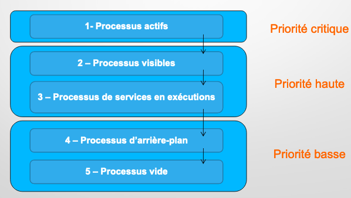
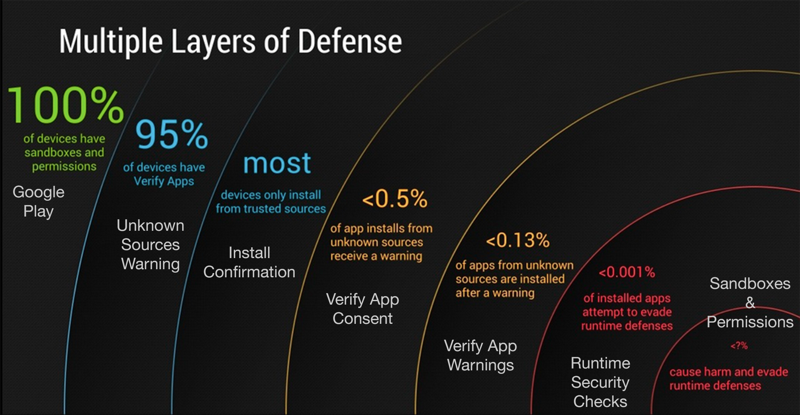

# Android Security

02/12/19 - By Pulsz

---

## What is Android ?

**Android** is a Linux based operating system it is designed primarily for touch screen mobile devices such as smart phones and tablet computers. 
The operating system have developed a lot in last 15 years starting from black and white phones to recent smart phones or mini computers. It is one of the most widely used mobile OS.

## Android base configuration

**Android Studio**

- IDE, based on IntelliJ IDEA

- Interface construction: WYSIWYG (WhatYouSeeIsWhatYouGet)

**AVD -Android Virtual Device**

- simulate the environment of a mobile phone with the virtual terminal manager

**SDK - Software Development Kit**

- Installation of modules / libs

**Gradle** manages:

- Dependency management

- Compilation automation

- The creation of the APK

- The deployment of the APK

**Manifest**

- Contains general information: Version of the app, SDK, theme

- And permissions and configurations:
  
  - Activities
  
  - Services
  
  - Diffusion receiver
  
  - Content provider

- Tags :
  
  - `uses-feature` : details on app speciels (ex: Camera
  
  - `supports-screen` : supported screen dimensions
  
  - `<uses-permission>` : permissions required to use the app
  
  - `<permission`: declaration of personal permission (access by a third party service to the app data)

**Ressources** : 

- dossier res
  
  - contain images / file xml / layout / drawable / colors / strings

**Priority** :

At any time the Android framework can decide to set the process to free up space or space for other applications.



**Toast** : correspond to a very short and visible notifications

## Why does it need security ?

It supports a large number of applications on smartphones, so there is a lot of data that can be collected and stolen by malicious programmers.
Nowadays, Android as an operating system is very 
secured.

It has different layers of protection to keep malware away.

However, Android is an **open system that trusts the user and his developer community to do the right thing**. 

If you want, you can give a lot of permissions and even give access to deeper parts of your system, if you have a rooted phone.

Android tries to protect you from yourself, but it allows you to have the last word on what to install and to which app permission should be granted.

As in any discussion about security, these things open you up to malware, not because it's bad, but because **users are the weak link**. So when it comes to Android security, it's not so that Android is inherently uncertain, we are. Android gives us a lot of power, and with great power comes great responsibility.

## Layers of security

Android was designed with security as one of its cornerstone principles.
Without comparing it to any other platform, it does a really good job of making sure processes don't collect too much information (or use too many resources) without permission, that no app or process gets access to the system level with inadequate privileges, and that the user is generally always aware of what's happening behind the scenes.



Just to get installed, an app has to get through all this :

- Android Store or an unknown sources warning (if it's enabled on your phone);

- The user confirm the installation;

- Has to get past Google's "Verify Apps" security feature, which checks an APK against its own database of malware before it can be installed (more on this later); 

- The app is sandboxed and restricted to the permissions granted to it;

- Android's own security checks again whenever the app runs;

## What kind of attack malicious attacker can do ?

- Use lack of user vigilance and knowledge to implement the malware

- Encryption of user data (Classic Ransomware)

- Launch of the application at boot 

- Abusive permissions 

- Recovery of precise information (identity of the phone, geoloc etc.) 

- Data analysis for malware behavior

- Blocking of the device's sleep mode at WAKE_LOCK

- Code implementation via a C&C server

## Permissions

**Levels of Permission**

On Android, as an Application developer you are privy to certain permissions that your application can request. These permissions requested could be simply to access your camera or silently install 
applications on the device. To understand why certain permissions require manual interaction and others don't, let's dissect the permissions available to us:

1. Normal

2. Dangerous

3. Signature

4. SignatureOrSystem

**Normal** : 

- Default value

- system automatically grants this type of permission to a requesting application at installation, without asking for the user's explicit approval

**Dangerous** :

- give a requesting application access to private user data or control over the device that can negatively impact the user

- may be displayed to the user and require confirmation

**Signature** : 

- the system grants the permission only if the requesting application is signed with the same certificate as the application that declared the permission

**SignatureOrSystem** : 

- system grants only to applications that are in the Android system image or that are signed with the same certificate as the application that declared the permission

**Only dangerous permissions require user agreement.**

**Examples** of dangerous permissions :

An app must publicize the permissions it requires by including  `<uses-permission` tags in the app manifest.
For example, an app that needs to send SMS messages would have this line in the manifest:

```java
<uses-permission android:name="android.permission.SEND_SMS"/>
```

Or to use camera (hardware features) :

```
<uses-feature android:name="android.hardware.camera" android:required="false" />
```

If you declare `android:required="false"` for the feature, then Google Play allows your app to be installed on devices that don't have the feature. You
then must check if the current device has the feature at runtime by calling `PackageManager.hasSystemFeature()`, and gracefully disable that feature if it's not available.

*All others dangerous permissions :*

```java
READ_CALENDAR
WRITE_CALENDAR
CAMERA
READ_CONTACTS
WRITE_CONTACTS
GET_ACCOUNTS
ACCESS_FINE_LOCATION
ACCESS_COARSE_LOCATION
RECORD_AUDIO
READ_PHONE_STATE
READ_PHONE_NUMBERS 
CALL_PHONE
ANSWER_PHONE_CALLS 
READ_CALL_LOG
WRITE_CALL_LOG
ADD_VOICEMAIL
USE_SIP
PROCESS_OUTGOING_CALLS
BODY_SENSORS
SEND_SMS
RECEIVE_SMS
READ_SMS
RECEIVE_WAP_PUSH
RECEIVE_MMS
READ_EXTERNAL_STORAGE
WRITE_EXTERNAL_STORAGE
```

#### Intent

Agreements are devices for sending messages in synchronization between applications or components, such as activities, services... 

They can be used to send information or request access to certain features.

Generally speaking, they can be used to:

- Explicitly start an activity or service using the name of the class

- Launch an activity or service for the purpose of taking action on a set of data

- Announce an event that has occurred.

An intention can be translated as `I want you, system, to do...`. 

And it depends on the action requested and the context. They must be considered as a glue between activities that allows them to be linked to each other.

An intention is thus an action associated with data.

#### Broadcast receiver

**WTF is this ?**

A *broadcast receiver* (*receiver*) is an Android component for sending and receiving events through intents.
All registered receivers for an event are notified by the Android runtime once this event happens.

For example, applications can register for the `ACTION_BOOT_COMPLETED` system event
which is fired once the Android system has completed the boot process.

**How to implement it ?**

A receiver can be registered via the `AndroidManifest.xml` file.

Alternatively to this static registration, you can also register a receiver dynamically via the `Context.registerReceiver()` method.

The implementing class for a receiver extends the BroadcastReceiver class.

If the event for which the broadcast receiver has registered happens, the `onReceive()` method (its the only one) of the receiver is called by the Android system.

By default, the option `android:exported` is `true` and any applications can send intent to the broadcast receiver. It needs to be set at `false`.

## What can I do to protect myself though ?

- User vigilance

- No third party sources 

- Permission analysis

- Reverse engineering

## Way to reverse an APK (Android Application)

APKs are equivalent to an archive containing a certain number of files.

If you want to reverse engineer an app, you need to:

- Get the package from an android application (APK) on the Play store via the address: https://play.google.com/store/apps?hl=fr

- and https://apps.evozi.com/apk-downloader/
  
  - Once downloaded, it can be open via Android Studio menu `Profile or Debug APK`.
  
  - The opening of the package gives us access to a certain amount of information, but also files in `.dex`, in other words the classes compiled for Android as they can be for Java in `.class`. Thanks to Android Studio we can see here the code called `Smali Code`. 
    Smali is the equivalent of an assembler language generating Bytecode for the Dalvik VM in Android
  
  - In order to be able to read the code more easily, let's transform our Smali code into Java code : https://github.com/pxb1988/dex2jar
  
  - However, they are only `.class` files, their reading will always be difficult, so in order to be able to put them back in original JAVA, let's use a suitable tool to open our jar file:
    
    - JD-GUI (JAR decompilation graphical interface): http://jd.benow.ca/-Outil 
    
    - online (from APJ orJAR): http://www.javadecompilers.com

- **OR YOU CAN USE `jadx` tool to directly do all these steps automatically**
  
  - https://github.com/skylot/jadx

- The code is now available to reverse.

## Examples ?

For examples of implementation of malicious code into android apps, I made two example in my github. It can be open via Android Studio.
Links are here :

- https://github.com/smolveau/Widget_Overlay

- https://github.com/smolveau/SMS-Receiver

## Articles

https://lifehacker.com/how-secure-is-android-really-1446328680

https://www.elprocus.com/what-is-android-introduction-features-applications/

https://discussions.soti.net/thread/what-are-on-demand-permissions/

https://developer.android.com/guide/topics/permissions/overview

https://www.vogella.com/tutorials/AndroidBroadcastReceiver/article.html
